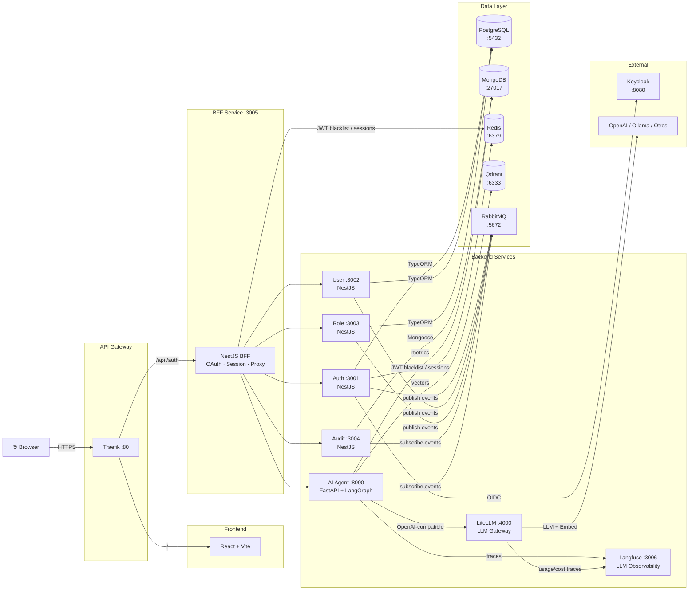

# Toka User Management System

Sistema de gestión de usuarios con microservicios e integración de IA.

**Prueba Técnica – Senior Full-Stack Engineer (IA) | Toka**

---

## Arquitectura



### Stack
| Capa | Tecnología |
|------|-----------|
| Backend (negocio) | NestJS + TypeScript |
| Backend (IA) | FastAPI + Python |
| Frontend | React + TypeScript + Zustand + Vite |
| API Gateway | Traefik |
| Auth/IdP | Keycloak (OIDC) |
| DB transaccional | PostgreSQL 16 |
| DB auditoría | MongoDB 7 |
| Cache/Sesiones | Redis 7 |
| Vector DB | Qdrant |
| Mensajería | RabbitMQ 3.13 |
| AI Framework | LangGraph + LangChain |
| LLM Gateway | LiteLLM |
| LLM Observability | Langfuse |

---

## Inicio Rápido

### Prerrequisitos
- Docker + Docker Compose v2
- Node.js >= 20
- Python >= 3.11 (para dev local del AI service)
- npm >= 10

### 1. Configurar variables de entorno

```bash
cp .env.example docker/.env
# Opcional: editar docker/.env con tus valores.
# Si no existe docker/.env, Compose usa los defaults definidos en docker-compose.yml.
# Para desarrollo gratuito local, usa Ollama a través de LiteLLM:
# AI_PROVIDER=litellm
# OPENAI_BASE_URL=http://litellm:4000/v1
# LLM_MODEL=toka-chat
# EMBEDDING_MODEL=toka-embedding
```

Antes de usar el asistente IA con Ollama + LiteLLM, instala Ollama y descarga los modelos:

```bash
ollama pull qwen2.5:7b
ollama pull nomic-embed-text
```

### 2. Construir y levantar toda la infraestructura

```bash
npm run docker:down
docker compose -f docker/docker-compose.yml build
npm run docker:up
docker compose -f docker/docker-compose.yml ps
```

Si cambiaste RabbitMQ, Keycloak o vienes de un estado con `ACCESS_REFUSED`, recrea volúmenes antes de levantar:

```bash
docker compose -f docker/docker-compose.yml down -v
docker compose -f docker/docker-compose.yml build --no-cache
npm run docker:up
```

Servicios disponibles:
- Frontend: http://localhost
- API Gateway (Traefik): http://localhost:80
- Traefik Dashboard: http://localhost:8090
- Keycloak Admin: http://localhost:8080 (admin/admin_secret_pass)
- RabbitMQ Management: http://localhost:15672
- Qdrant UI: http://localhost:6333/dashboard
- LiteLLM Gateway: http://localhost:4000
- Langfuse: http://localhost:3006 (admin@toka.local / toka_langfuse_admin)
- Open WebUI opcional: http://localhost:3007

Open WebUI se levanta solo como laboratorio interno:

```bash
docker compose -f docker/docker-compose.yml --profile ai-lab up -d open-webui
```

### 3. Desarrollo local (hot reload)

```bash
npm install
npm run dev
```

### 4. Tests

```bash
npm install
npm run test:coverage
```

> Para correr con Docker no necesitas `npm install`; Docker instala dependencias dentro de cada imagen.
> Para build/tests locales sí necesitas `npm install` en la raíz y dependencias Python del AI service.

---

## Estructura del Proyecto

```
toka-user-management/
├── docker/              # Docker Compose + configs infra
├── packages/
│   ├── shared-kernel/   # DDD base classes, JWT guard, RabbitMQ, Redis modules
│   └── shared-types/    # TypeScript interfaces compartidas
├── services/
│   ├── auth-service/    # NestJS — Auth + Keycloak
│   ├── user-service/    # NestJS — CRUD Usuarios
│   ├── role-service/    # NestJS — RBAC + Permisos
│   ├── audit-service/   # NestJS — Auditoría (MongoDB)
│   ├── bff-service/     # NestJS — Backend for Frontend
│   └── ai-agent-service/ # FastAPI — IA + RAG + LangGraph
├── frontend/            # React + Vite + Zustand
├── docs/                # Arquitectura, APIs, SDD artifacts
└── scripts/             # Utilidades y smoke tests
```

---

## SDD Artifacts

Ver `docs/sdd/` para los artefactos de SPECS-Driven Design:
- `docs/sdd/specs/` — Especificaciones (Fase 1)
- `docs/sdd/plans/` — Planes de arquitectura (Fase 2)
- `docs/sdd/tasks/` — Task decomposition (Fase 3)
- `docs/sdd/skills/` — Skills, Agents, Routines declarados

---

## Documentación

- [Arquitectura detallada](docs/architecture/README.md)
- [API Guide](docs/api/README.md)
- [Exercise 4 — Incident Diagnosis](docs/exercise-4-incident-diagnosis.md)
- [AGENTS.md](AGENTS.md) — SDD Constitution

---

## Testing

### Unit Tests (per service)

```bash
# NestJS services (Jest)
cd services/auth-service && npm test -- --coverage
cd services/user-service && npm test -- --coverage
cd services/role-service && npm test -- --coverage
cd services/audit-service && npm test -- --coverage

# FastAPI (pytest)
cd services/ai-agent-service && pytest --cov=src --cov-report=term-missing

# Frontend (Vitest)
cd frontend && npm run test:cov
```

Coverage target: **≥ 70%** per service.

### Smoke Test (full E2E flow)

```bash
# Start system first
npm run docker:up

# Wait for all health checks (≈ 60s)
sleep 60

# Run smoke test
bash scripts/smoke-test.sh

# Or against a different host
bash scripts/smoke-test.sh http://my-server.com
```

The smoke test validates the full flow:
1. All service health checks
2. Auth: login → JWT returned
3. Users: create → read → update → delete
4. Roles: list + seed roles present
5. Audit: events queryable
6. AI: document ingestion + chat response
7. Auth: logout

---

## Security

- JWT RS256 via Keycloak JWKS (no shared secrets)
- JWT blacklist in Redis on logout
- HttpOnly + Secure + SameSite=Strict session cookies (BFF)
- OAuth 2.0 PKCE flow (browser never sees client secret)
- CSRF double-submit cookie
- Helmet headers on all NestJS services
- Rate limiting (Redis sliding window)
- Input validation: `class-validator` (NestJS) + Pydantic (FastAPI)
- Parameterized queries only (TypeORM — no raw SQL)
- CORS allowlist per service

---

## Credentials (dev only)

| Service | User | Password |
|---------|------|----------|
| Keycloak Admin | admin | admin_secret_pass |
| RabbitMQ | toka_rabbit | toka_rabbit_pass |
| PostgreSQL | toka_user | toka_secret_pass |
| MongoDB | toka_user | toka_secret_pass |
| Redis | — | toka_redis_pass |
| App Admin | admin@toka.com | Admin123! |

**Never use these credentials in production.**
