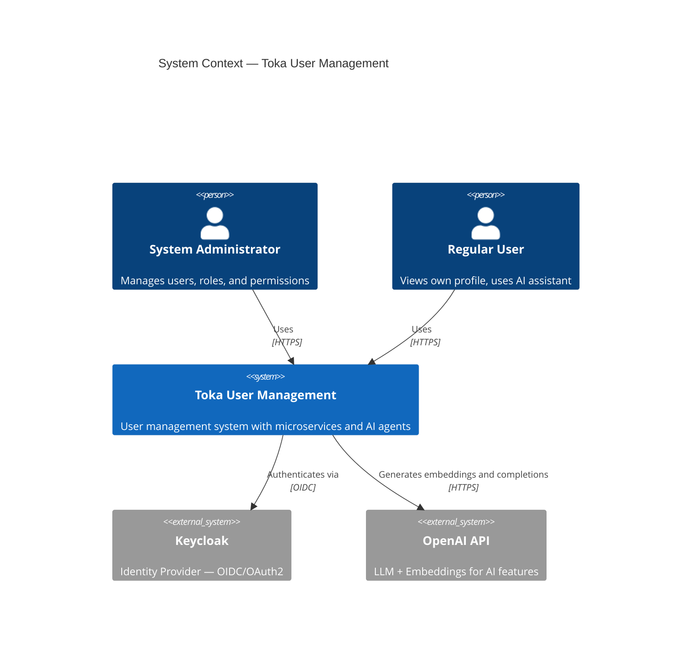
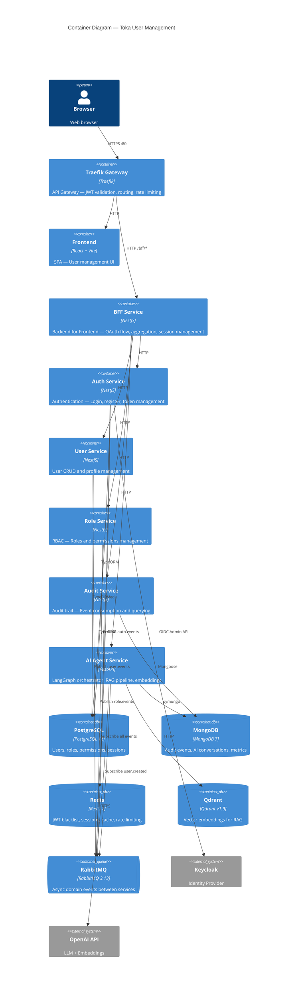

# Architecture Documentation

## C4 Context Diagram



## C4 Container Diagram



## DDD Bounded Contexts

| Context | Services | DB | Events Published |
|---------|---------|-----|-----------------|
| Identity | Auth, User | PostgreSQL | user.*, auth.* |
| Authorization | Role | PostgreSQL | role.* |
| Observability | Audit | MongoDB | (consumer only) |
| Intelligence | AI Agent | Qdrant, MongoDB | (consumer only) |

## Clean Architecture Layers

```
┌─────────────────────────────────────────────────┐
│  Presentation Layer                              │
│  Controllers, Guards, Interceptors, Pipes        │
├─────────────────────────────────────────────────┤
│  Application Layer                               │
│  Use Cases, DTOs, Port Interfaces                │
├─────────────────────────────────────────────────┤
│  Domain Layer                                    │
│  Entities, Value Objects, Domain Events          │
│  Repository Interfaces (ports)                   │
├─────────────────────────────────────────────────┤
│  Infrastructure Layer                            │
│  TypeORM repos, Redis, RabbitMQ, Keycloak       │
│  (implementations of domain ports)               │
└─────────────────────────────────────────────────┘
```

Dependency rule: outer layers depend on inner layers. Domain layer has ZERO external dependencies.

## Communication Patterns

### Synchronous (REST)
- BFF → all backend services via HTTP
- AI Agent → User/Role/Audit services (tool calls during agent execution)
- All requests carry `X-Correlation-Id` and `Authorization: Bearer <jwt>`

### Asynchronous (RabbitMQ)
- Domain events published after successful state mutations
- Audit Service consumes ALL events (audit trail)
- Services subscribe only to events they need (decoupled)
- Dead Letter Queue for failed messages
