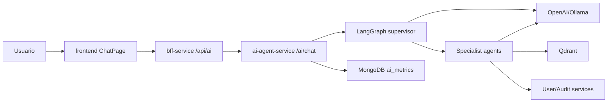
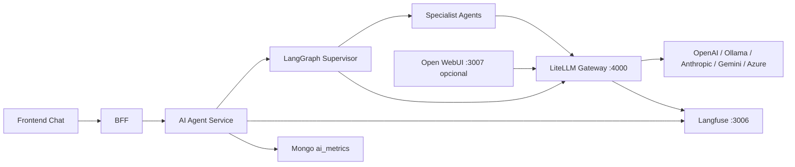

# Plan de Implementacion: Gateway LLM y Observabilidad

Estado: Implemented
Fecha: 2026-06-22
Objetivo: incorporar LiteLLM como gateway de modelos y Langfuse como observabilidad LLM para medir prompts, respuestas, costos, latencia, trazas y comportamiento de agentes, sin romper el chat actual ni el patron LangGraph supervisor.

Resultado implementado:

- LiteLLM agregado como gateway OpenAI-compatible en Docker.
- Langfuse self-host v3 agregado para trazas locales.
- Open WebUI agregado como consola opcional bajo profile `ai-lab`.
- `ai-agent-service` ahora genera `trace_id`, propaga metadata del modelo y guarda metricas enriquecidas.
- Supervisor y agentes registran `agent_path`, decisiones de routing, tool calls y errores.
- El frontend muestra el identificador corto de traza en cada respuesta del chat.

## 1. Contexto Actual

La aplicacion ya tiene un AI Agent Service separado en FastAPI con LangGraph y LangChain. El frontend no llama a proveedores LLM directamente: pasa por `frontend -> bff-service -> ai-agent-service`.

Flujo actual:



Puntos relevantes encontrados:

- `services/ai-agent-service/src/infrastructure/llm/provider.py` ya centraliza `get_chat_model()` y `get_embeddings_model()`.
- `OPENAI_BASE_URL` ya existe en `Settings`, por lo que LiteLLM puede entrar como endpoint OpenAI-compatible sin reescribir todos los agentes.
- `services/ai-agent-service/src/agents/orchestrator.py` ya mide `latency_ms` y guarda metricas basicas con `track_metrics()`.
- `services/ai-agent-service/src/evaluation/metrics.py` guarda `inputTokens`, `outputTokens` y `estimatedCostUsd`, pero hoy esos valores dependen de `metadata` y casi ningun agente los llena.
- `docs/sdd/plans/pdf-compliance-remediation-plan.md` ya pide en Fase 5 y Fase 7: modelo, costo estimado, agent path, errores/rate limits y `agent_outputs`.

## 2. Inventario de Agentes

### Supervisor

Archivo: `services/ai-agent-service/src/agents/supervisor.py`

Responsabilidad actual:

- Decide el siguiente agente con un LLM.
- Soporta loop multi-agent hasta `supervisor_max_rounds`.
- Fuerza `FINISH` cuando se llega al maximo de rondas.
- Sintetiza respuestas con `_synthesize()`.

Cambios necesarios:

- Registrar cada decision como span/trace en Langfuse.
- Guardar `agent_path`, `routing_reasoning`, `supervisor_rounds`, `model`, `provider`, `error_type`.
- Ajustar el prompt para incluir `admin_assistant`, porque `VALID_AGENTS` lo acepta pero `SUPERVISOR_PROMPT` no lo lista en el equipo.
- Evitar que el supervisor pierda contexto operativo cuando LiteLLM haga fallback de modelo.
- En errores de proveedor, distinguir `rate_limit`, `quota`, `timeout`, `provider_unavailable` y `fallback_used`.

### Orchestrator

Archivo: `services/ai-agent-service/src/agents/orchestrator.py`

Responsabilidad actual:

- Construye el grafo LangGraph.
- Inicializa estado.
- Ejecuta `graph.ainvoke()`.
- Deriva `intent` desde `agent_outputs`.
- Persiste metricas basicas.

Cambios necesarios:

- Crear un `trace_id` por request y propagarlo a Langfuse, MongoDB y logs.
- Guardar `agent_path` derivado de los nodos visitados.
- Guardar `agent_outputs` resumidos o con redaccion configurable.
- Incluir metadata de modelo: `model`, `provider`, `base_url_kind`, `fallback_model`.
- Envolver la ejecucion del grafo con tracing.
- Mantener modo degradado si no hay proveedor LLM configurado.

### frontend_agent

Archivo: `services/ai-agent-service/src/agents/frontend_agent.py`

Responsabilidad actual:

- Busca contexto en Qdrant con `vector_search`.
- Llama LLM con prompt especialista de frontend.

Cambios necesarios:

- Span por `vector_search`.
- Span por llamada LLM.
- Metadata: `agent=frontend_agent`, `tools=["vector_search"]`, `context_found`.

### backend_agent

Archivo: `services/ai-agent-service/src/agents/backend_agent.py`

Responsabilidad actual:

- Usa `create_react_agent`.
- Tools: `user_lookup`, `audit_search`, `vector_search`.

Cambios necesarios:

- Capturar tool calls y errores de tools.
- Registrar si hubo llamadas a servicios internos.
- Metadata: `agent=backend_agent`, `tools`, `tool_errors`.

### database_agent

Archivo: `services/ai-agent-service/src/agents/database_agent.py`

Responsabilidad actual:

- Consulta `user_lookup` para conteo o datos.
- Genera respuesta con prompt de base de datos.

Cambios necesarios:

- Span por consulta live.
- Registrar si el dato live fallo y si la respuesta fue sin datos reales.
- Metadata: `agent=database_agent`, `live_data_used`.

### rag_agent

Archivo: `services/ai-agent-service/src/agents/rag_agent.py`

Responsabilidad actual:

- Recupera contexto con `vector_search`.
- Genera respuesta basada en contexto.

Cambios necesarios:

- Registrar retrieval: top_k, cantidad de chunks, score promedio, source ids.
- Span separado para retrieval y generation.
- Metadata: `agent=rag_agent`, `retrieval_hits`, `sources`.

### report_agent

Archivo: `services/ai-agent-service/src/agents/report_agent.py`

Responsabilidad actual:

- Consulta `user_lookup` y `audit_search`.
- Genera reporte estructurado.

Cambios necesarios:

- Registrar tools usadas y datos disponibles.
- Registrar reportes sin datos como degraded.
- Metadata: `agent=report_agent`, `tool_results_count`.

### admin_assistant

Archivo: `services/ai-agent-service/src/agents/admin_assistant.py`

Responsabilidad actual:

- Usa `create_react_agent`.
- Tools: `user_lookup`, `audit_search`, `vector_search`.

Cambios necesarios:

- Agregarlo al `SUPERVISOR_PROMPT`.
- Trazar tool calls igual que `backend_agent`.
- Distinguir acciones de solo lectura frente a futuras acciones mutables.

## 3. Arquitectura Objetivo



Principio de diseno:

- LiteLLM controla acceso a modelos, virtual keys, budgets, retries, fallback y costos.
- Langfuse observa prompts, respuestas, latencia, trazas, sesiones, errores y evaluaciones.
- MongoDB conserva metricas operativas propias de la app.
- Open WebUI queda opcional como consola interna de prueba, no como reemplazo del chat de Toka.

## 4. Fases de Implementacion

### Fase 1 - Infra Docker y configuracion

Archivos esperados:

- `docker/docker-compose.yml`
- `docker/.env.example`
- `docker/litellm/config.yaml`
- posiblemente `README.md` y `docs/runbook-local.md`

Tareas:

1. Agregar servicio `litellm` en red `ai` y `backend`.
2. Agregar PostgreSQL dedicado o schema/base para LiteLLM si se habilita proxy DB.
3. Agregar servicios Langfuse requeridos para self-host local: web, worker, postgres/clickhouse/redis segun compose recomendado de Langfuse.
4. Definir puertos locales:
   - LiteLLM: `4000`
   - Langfuse: `3006`
   - Open WebUI opcional: `3007`
5. Configurar `ai-agent-service` para usar:
   - `OPENAI_BASE_URL=http://litellm:4000/v1`
   - `OPENAI_API_KEY=${LITELLM_VIRTUAL_KEY}`
6. Mantener modo Ollama local como opcion gratuita.

Criterios de aceptacion:

- `docker compose -f docker/docker-compose.yml ps` muestra LiteLLM y Langfuse healthy.
- `ai-agent-service` no llama directo a OpenAI cuando `OPENAI_BASE_URL` apunta a LiteLLM.
- El stack sigue levantando sin Open WebUI.

### Fase 2 - Gateway LiteLLM

Archivos esperados:

- `docker/litellm/config.yaml`
- `services/ai-agent-service/src/infrastructure/llm/provider.py`
- `services/ai-agent-service/tests/test_llm_provider.py`

Tareas:

1. Definir modelos iniciales:
   - `gpt-4o-mini` via OpenAI si hay key.
   - `ollama/qwen2.5:7b` o `ollama/qwen2.5-coder:7b` para desarrollo gratuito.
   - embedding local `ollama/nomic-embed-text` o OpenAI `text-embedding-3-small`.
2. Configurar fallback de modelo en LiteLLM.
3. Configurar budgets/rate limits por virtual key.
4. Agregar health check para LiteLLM.
5. Ajustar tests de provider para validar endpoint LiteLLM.

Criterios de aceptacion:

- Una llamada desde `ai-agent-service` pasa por LiteLLM.
- LiteLLM muestra usage/cost por request.
- Si falla un proveedor, el error queda clasificado y no rompe el servidor completo.

### Fase 3 - Langfuse tracing desde AI Agent Service

Archivos esperados:

- `services/ai-agent-service/pyproject.toml`
- `services/ai-agent-service/src/config.py`
- `services/ai-agent-service/src/infrastructure/observability/`
- `services/ai-agent-service/src/agents/orchestrator.py`
- `services/ai-agent-service/src/agents/supervisor.py`
- agentes especialistas
- tests de supervisor/orchestrator

Tareas:

1. Agregar dependencias de Langfuse/LangChain callback si son compatibles con la version actual.
2. Agregar settings:
   - `LANGFUSE_ENABLED`
   - `LANGFUSE_HOST`
   - `LANGFUSE_PUBLIC_KEY`
   - `LANGFUSE_SECRET_KEY`
   - `LLM_TRACE_PROMPTS`
   - `LLM_REDACT_PII`
3. Crear wrapper de observabilidad para:
   - crear trace por request
   - crear spans por supervisor decision
   - crear spans por agent node
   - crear spans por tool call
   - capturar errores
4. Propagar `trace_id` en `metadata`.
5. Añadir redaccion basica configurable para no mandar datos sensibles a Langfuse si se requiere.

Criterios de aceptacion:

- Cada `/ai/chat` crea una traza en Langfuse.
- La traza muestra supervisor, agente elegido, tools, latencia y respuesta.
- Si Langfuse esta caido, el chat sigue funcionando y solo loguea warning.

### Fase 4 - Ajustes del supervisor y estado LangGraph

Archivos esperados:

- `services/ai-agent-service/src/agents/orchestrator.py`
- `services/ai-agent-service/src/agents/supervisor.py`
- `services/ai-agent-service/src/prompts/system_prompts.py`
- `services/ai-agent-service/tests/test_supervisor.py`

Tareas:

1. Extender `AgentState` con:
   - `trace_id`
   - `agent_path`
   - `routing_decisions`
   - `model_metadata`
   - `errors`
2. Actualizar cada agente para append a `agent_path`.
3. Actualizar supervisor prompt para incluir `admin_assistant`.
4. Guardar `routing_reasoning` en estado.
5. Definir comportamiento dinamico:
   - si falla retrieval, continuar con respuesta degradada y marcar `retrieval_error`.
   - si falla un tool live, continuar con lo disponible y marcar `tool_error`.
   - si falla LLM primario y LiteLLM usa fallback, registrar `fallback_used`.
   - si se excede `supervisor_max_rounds`, sintetizar con lo ya disponible.

Criterios de aceptacion:

- `intent` sigue derivandose de agentes usados.
- `agent_path` aparece en metricas.
- Tests cubren routing, max rounds y errores de proveedor.

### Fase 5 - Persistencia de metricas enriquecidas

Archivos esperados:

- `services/ai-agent-service/src/evaluation/metrics.py`
- `docs/sdd/specs/domain-model.md`
- posiblemente endpoint administrativo de metricas

Tareas:

1. Ampliar `ai_metrics` con:
   - `traceId`
   - `provider`
   - `model`
   - `fallbackModel`
   - `agentPath`
   - `routingDecisions`
   - `toolCalls`
   - `errorType`
   - `estimatedCostUsd`
   - `inputTokens`
   - `outputTokens`
2. Decidir si se guardan prompts/respuestas completas en MongoDB o solo en Langfuse.
3. Agregar indices por `timestamp`, `userId`, `sessionId`, `traceId`, `model`.
4. Mantener compatibilidad con documentos antiguos.

Criterios de aceptacion:

- MongoDB conserva resumen operacional.
- Langfuse conserva detalle de trazas.
- No se duplican datos sensibles sin decision explicita.

### Fase 6 - Open WebUI opcional

Archivos esperados:

- `docker/docker-compose.yml`
- `docker/.env.example`
- docs/runbook

Tareas:

1. Agregar servicio `open-webui` detras de un profile Docker, por ejemplo `--profile ai-lab`.
2. Conectarlo a LiteLLM como endpoint OpenAI-compatible.
3. Mantener branding de Open WebUI si se usa version actual.
4. No exponerlo como UI publica del producto.

Criterios de aceptacion:

- `docker compose --profile ai-lab up -d open-webui` levanta consola interna.
- Open WebUI puede hablar con LiteLLM.
- El frontend de Toka sigue siendo el chat principal.

### Fase 7 - Validacion y pruebas

Comandos de verificacion esperados:

```bash
npm run docker:down
docker compose -f docker/docker-compose.yml build
npm run docker:up
docker compose -f docker/docker-compose.yml ps
docker compose -f docker/docker-compose.yml logs -f ai-agent-service litellm
```

Tests esperados:

```bash
cd services/ai-agent-service
python -m pytest --cov=src --cov-report=term-missing
```

Smoke test:

```bash
npm run smoke-test
```

Prueba manual:

1. Abrir `http://localhost`.
2. Iniciar sesion.
3. Ir a Chat.
4. Enviar preguntas:
   - "Explicame la arquitectura del sistema"
   - "Cuantos usuarios hay?"
   - "Genera un reporte corto de auditoria"
   - "Como funciona el frontend auth flow?"
5. Abrir Langfuse y validar que existan trazas por cada pregunta.
6. Abrir LiteLLM y validar usage/cost/model.

## 5. Decisiones Propuestas

- Usar LiteLLM primero porque el codigo ya soporta `OPENAI_BASE_URL`.
- Usar Langfuse como fuente principal de trazas y MongoDB como resumen operacional interno.
- No reemplazar `ChatPage` por Open WebUI.
- Open WebUI debe quedar bajo profile opcional para laboratorio interno.
- El supervisor debe ser ajustado, no reemplazado.
- El primer alcance debe ser observabilidad y gateway; evaluaciones automaticas pueden quedar para una fase posterior.

## 6. Riesgos

- Versiones de LangChain/Langfuse pueden requerir ajustes porque el proyecto usa `langchain>=0.2,<0.3`.
- Langfuse self-host puede agregar varios contenedores y subir consumo local.
- Si se trazan prompts completos, puede haber exposicion de PII o datos internos.
- LiteLLM puede reportar costos exactos para proveedores conocidos, pero para modelos locales/Ollama el costo sera cero o estimado manualmente.
- Open WebUI v0.6.6+ tiene restricciones de branding; no conviene white-label sin revisar licencia.

## 7. Comandos de ejecucion una vez implementado

Modo gratuito local con Ollama + LiteLLM + Langfuse:

```bash
cd "/Users/jair/Documents/Desarrollador Full Stack IA"
cp docker/.env.example docker/.env
ollama pull qwen2.5:7b
ollama pull nomic-embed-text
npm run docker:down
docker compose -f docker/docker-compose.yml build
npm run docker:up
docker compose -f docker/docker-compose.yml ps
```

Modo con OpenAI via LiteLLM:

```bash
cd "/Users/jair/Documents/Desarrollador Full Stack IA"
cp docker/.env.example docker/.env
# editar docker/.env y definir OPENAI_API_KEY, LITELLM_MASTER_KEY y LITELLM_VIRTUAL_KEY
npm run docker:down
docker compose -f docker/docker-compose.yml build
npm run docker:up
docker compose -f docker/docker-compose.yml ps
```

Modo laboratorio con Open WebUI:

```bash
cd "/Users/jair/Documents/Desarrollador Full Stack IA"
docker compose -f docker/docker-compose.yml --profile ai-lab up -d open-webui
```

URLs esperadas:

- Toka frontend: `http://localhost`
- LiteLLM: `http://localhost:4000`
- Langfuse: `http://localhost:3006`
- Open WebUI opcional: `http://localhost:3007`
